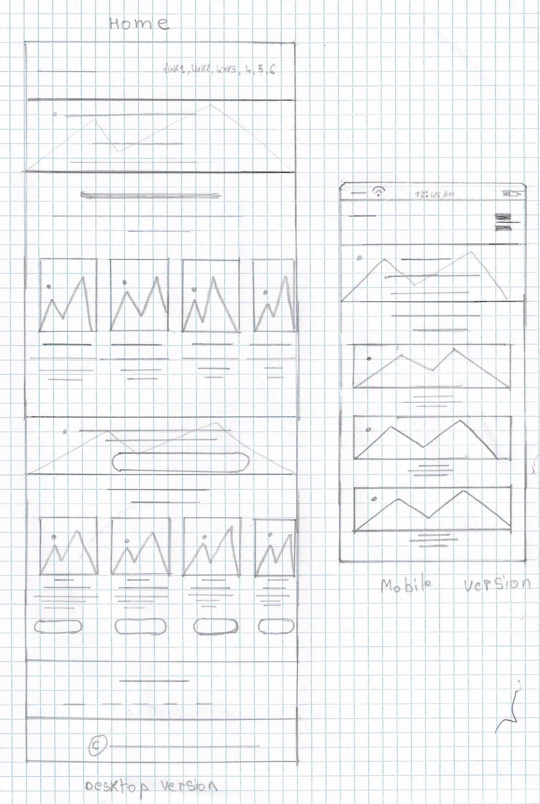
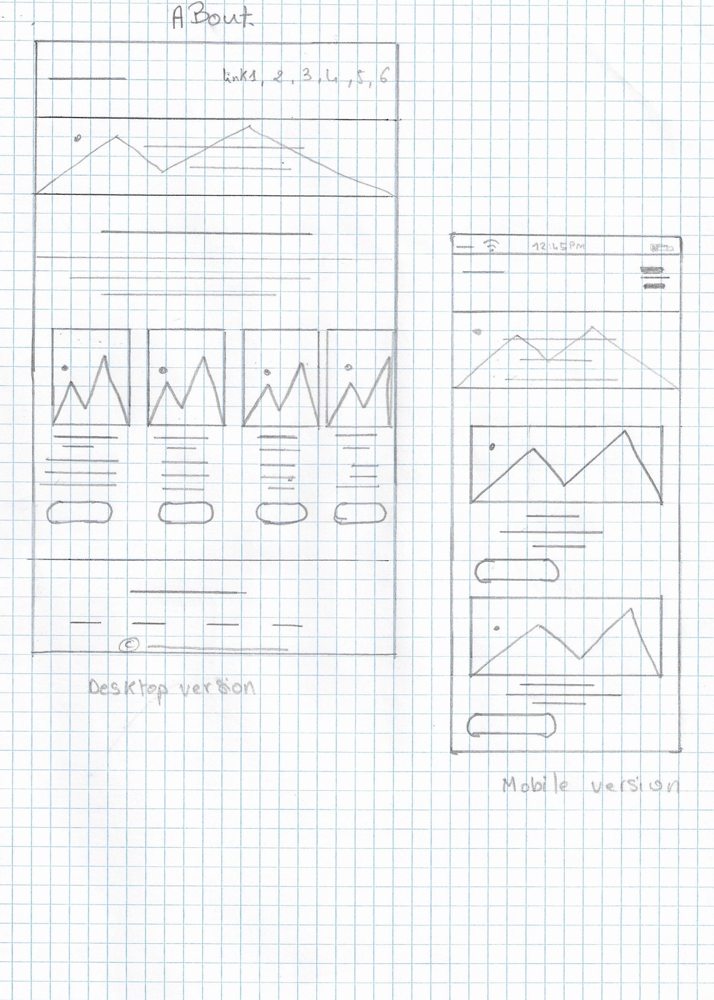
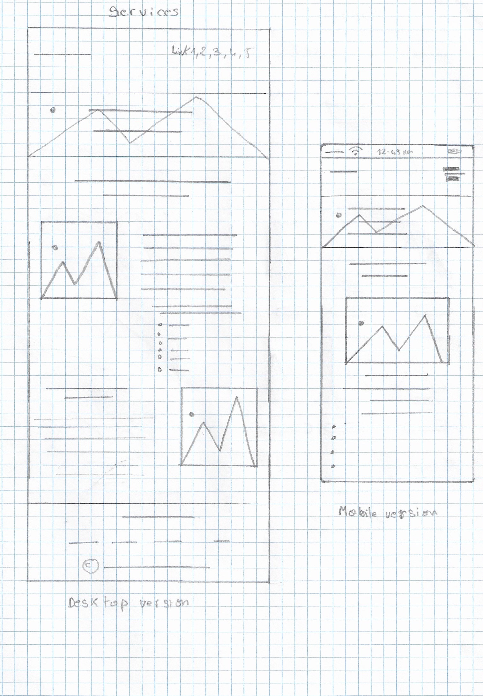
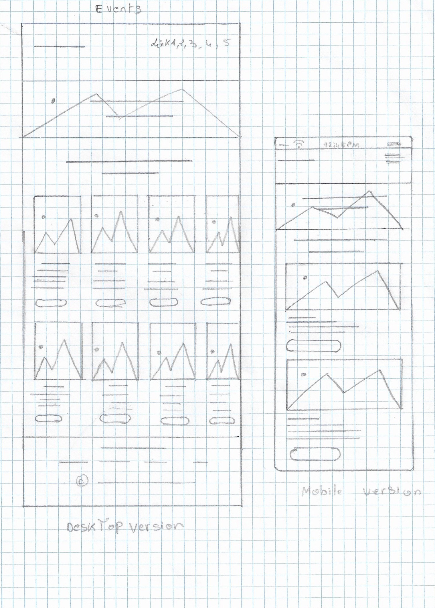
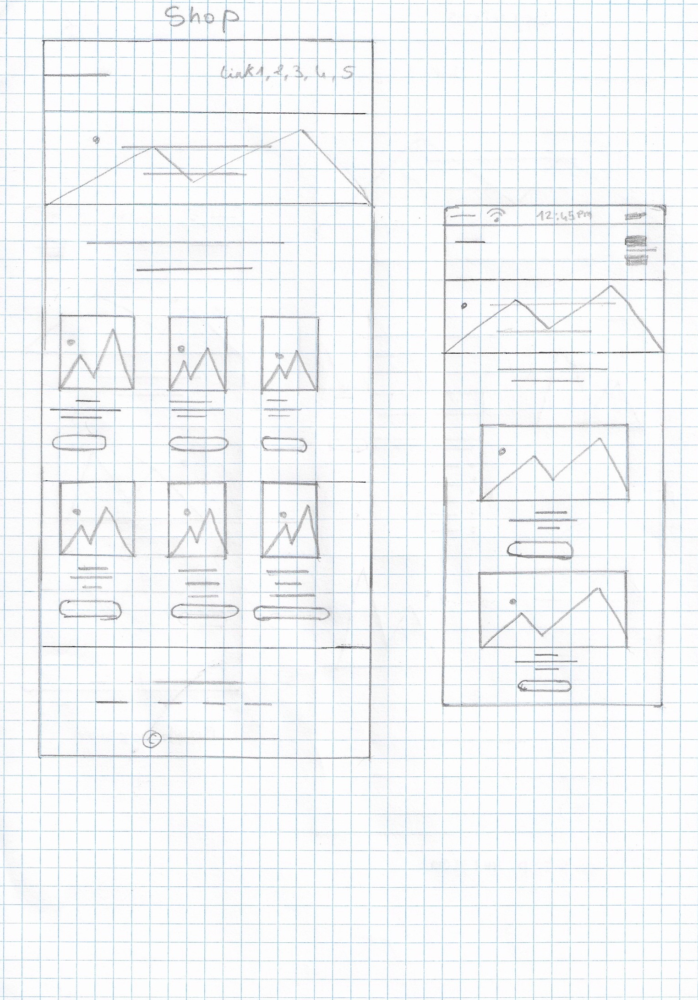
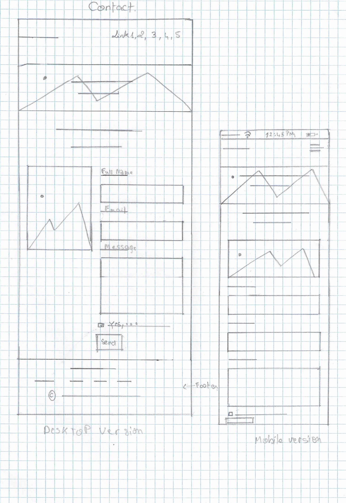

## Website URL:
https://4sinen69.github.io/PetCare.github.io/
# Background
Many people take the decision of abandoning their pets just because they cannot take proper care of them, or in other words they consider their pets as a burden. Other owners try to look after their pets but fail , due to their lack of knowledge about the right way of taking care of a pet.  I have chosen to do a PetCare center to solve this serious issue and make things easier for the pet owners. The PetCare combines the Veterinary care and the non-medical care. It offers a wide range of services that guarantee pets a great care.  At PetCare center  you can find so many enthusiastic and dedicated individuals passionate about pets and their well-being, from the veterinary surgeons and qualified nurses  and groomers to the nutrition consultants. Highly trained and caring, each of them has a role to play in making pets healthy and good-looking.

# Wire Frames

**Home Page**

**About Us page**

**Services Page**

**Events Page**

**Shop page**

**Contact Page**

# Colour Choices
Colour is one of the most powerful tools in a website design, Choosing the right colours is essential for your online success. Colours can be your most powerful tool to gain a reaction from your targeted audience. 
In my website I have chosen to use Black and shades of black  (rgb(68, 68, 68); #222;  rgba(34, 34, 34, 0.075); rgba(0, 0, 0, 0.07))
Black is powerful, bold, elegant and serious at the same time . I can witness that Black is not only perfectly fitting in my website design , but also contributes indirectly  in making  the audience feel the importance of pets care and needs.
I have used grey and shades of grey (rgb(68, 68, 68); #ccc; rgba(103, 135, 144, 1); #d6d6d6; #c7c7c7)
Grey is the colour of respect, wisdom ,patience, modernity. This balanced colour will help me manifest the website sophistication  and cover details and explanations to deliver a good understanding to the pets owners.
My colour scheme contains also white (white; #fff)
White still remains the undefeated ruler as far as the choice of colours for websites is considered. White is tied to purity, innocence, and positivity.  This positive colour will help me keep my customers reassured about our honesty and principles. 
And since green reflects trust and healing, I have used it (#4CAF50)  for the send button in the contact form to encourage visitors on sending whatever queries they have in mind. As well as showing to the customers that we are always available and all ears, which will help us build trust and loyalty. 
We can see the slight use of red (#ed6436 inset ; #f00), which is an active and strong colour that reflects intensity. My use of red was for the buy button, to encourage pet owners on buying quality food to their loved pets. I have used it in highlighting all the cookie alert to manifest the importance of the privacy policy.

# Accessibility
I have taken many measures to conform to W3C accessibility standards:
Such as providing sufficient contrast between foreground and background, Since some people cannot read text if there is not sufficient contrast between the text and background, others cannot read bright colors and need low luminance.
Ensuring that form elements include clearly associated labels by ensuring that all fields have a descriptive label adjacent to the fields and placing labels to the left.
Providing easily identifiable feedback by alerting the user when a form is not completed by using  error icon, and background colour to make the error stands out.
Using headings and spacing to group related content, reduce clutter and make relationships between content more apparent.
Keeping content clear and concise by writing short, clear sentences and paragraphs. Avoiding unnecessarily complex words and phrases, and using images to help clarify meaning.
And finally writing code that adapts to the user's technology by using responsive design to adapt the display to different zoom states and viewport sizes, such as on mobile devices and tablets.

# GDPR
I have taken measures to conform to the GDPR by creating a privacy policy text respecting our needs and the  8 individuals rights and by adding an opt-in form in the Contact page asking customers whether they would like to receive news, tips & tricks on marketing from PetCare.
When visiting our website we inform the visitor by showing the following text:
"This website stores cookies on your computer. These cookies are used to provide more personalised service to you, both on this website and through other media. To find out more about the cookies we use, see our Privacy Policy.
If you click decline we won't track your information when you visit our site. But in order to comply with your preferences, we'll have to use just one tiny cookie so that you're not asked to make this choice again."

# Distance Selling
This Website does not sell anything online that merits the distribution of distance selling acts.

# Evaluation
My PetCare website is a promotion to a center that combines both veterinary and non-medical  care for pets, in order to help pet owners looking after their pets and make them satisfy all their needs. this is through a home page that demonstrates some very important services and some events done specifically for pet owners such as first aid courses, and pet nutrition advice that will help you keep your pet healthy and vital . Besides, an About Us page that gives you the opportunity to meet our experienced and professional team from veterinary surgeons and groomers to pets nutrition consultants that will work hard to fulfill all your pet's needs and provide pet owners important advice. As well as the services page, that shows plethora of services that guarantee a good health and great shape to your pet. In addition to the shop page that demonstrates good food quality with reasonable prices that every pet deserves. As well as an events page that makes you part of plenty of educational and funny events, that are destined for both pets and owners and even for kids to make them well aware of pets care importance and make them love and respect animals in general. Moreover , a contact page that enables visitors to get in touch with us , book appointments and contact us whenever they have enquiries in mind, because we aim to build with our customers a relation based on trust and respect.

Building my website wasn't an easy task, I encountered some problems along my way. 
At first, choosing a good design can be a little bit intimidating, because of it's great impact ,
the design sets the first impression, and my aim is to make a positive impact on the visitors, because  the impression you make on them can either get them to remain on your page and learn about your business or leave your page and turn to a competitor. 
Also finding high-quality images that will greatly improve my credibility, and improve the user experience. Images are a great emotion trigger that you can use to draw your visitors in and get them engaged in your content.

The testing is a very important phase, to test my website on multiple devices, I have used Chrome DevTools which is incredibly useful and free to use.
I tested my website on multiple devices; I found out that my website is responsive and automatically adjusts for different-sized screens and viewports.

It takes few seconds for visitors to form an opinion about your website and determine whether they’re going to scroll down  or leave. So your website’s design has to entice your visitors enough to want to stay on the site and learn more about your services.

Firsty, Great design begins with an understanding of who it’s for. Understanding your customers is a crucial factor for being able to choose the right design elements.
So, before jumping head-first into designing my website, I needed to be clear on it's purpose. My website is called PetCare, the specific purpose is about offering a wide range of services to pets and help them stay healthy and happy , along with organising events that both pets and owners will benefit from, these events aim to provide to the owners petcare advices and informations . 
Also, the purpose of the website is to be eye-catching, serious,  trust-worthy, active and simple and to perfectly display the high quality services and our professional team.  It shows the customers that we are here to provide pets a  good veterinary care from surgeries to vaccinations and non-medical care from grooming to pampering and demonstrate that we deserve their trust. A perfect design must be reflecting all these aims.
secondly, the target audience plays  a significant role in deciding the design too.  The target audience for my website will largely be aimed at pet owners .So, the website design must mirror Pets Care theme.
My website design was based also on choosing appropriate colours, because colours can influence people's mood and emotions, so the combination of simple colours and their shades with some bold colours made the perfect blend to stimulate trust and assurance to make the owners believe that we are worth relying on.

